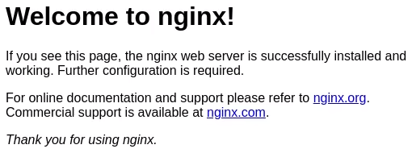

# Start2Impact MongoDB project: Bitcoin exchange
Exchange service to trade BTC/USD.
The web-app only provides API endpoints with the following features:

#### API endpoints
1) ```/api/rest-auth/registration/``` User registration via token.
2) ```/api/rest-auth/login/``` Authentication via token.
3) ```/api/profile/``` Retrieve profile information and account balance.
4) ```/api/orders/``` List all your orders or create a new one.
5) ```/api/orders/order_id/``` Retrieve or delete a specific order, only active orders can be deleted.
6) ```/api/orders/latest/``` Retrieve all active orders opened by other users.

#### Live demo: [Bitcoin exchange](http://13.36.123.111/8000)

## Frameworks and technologies used:
#### Frameworks
- [Django 2.2](https://docs.djangoproject.com/en/2.2/) - Back-end
- [Django REST Framework 3.12](https://www.django-rest-framework.org/) - APIs

#### Databases
- [MongoDB 4.4](https://docs.mongodb.com/v4.4/) - Storage and web-app structure

#### Technologies
- [Djongo 1.3](https://www.djongomapper.com/get-started/) - MongoDB mapper

## Setup for an Ubuntu 20 server
For compatibility issues between djongo and django-allauth it is necessary to use ```djongo==1.3.1```.

#### Clone the repository and install some required packages:
```
$ git clone https://github.com/pogginicolo98/start2impact_exchange
$ sudo add-apt-repository ppa:deadsnakes/ppa
$ sudo apt-get update
$ sudo apt-get install python3.9
$ sudo apt-get install gcc
$ sudo apt-get install python3-virtualenv
```

#### Install MongoDB:
```$ start2impact_exchange$ wget -qO - https://www.mongodb.org/static/pgp/server-4.4.asc | sudo apt-key add -```
The operation should respond with an ```OK```.

However, if you receive an error indicating that gnupg is not installed, you can:
```
$ sudo apt-get install gnupg
$ wget -qO - https://www.mongodb.org/static/pgp/server-4.4.asc | sudo apt-key add -
```

```
$ echo "deb [ arch=amd64,arm64 ] https://repo.mongodb.org/apt/ubuntu focal/mongodb-org/4.4 multiverse" | sudo tee /etc/apt/sources.list.d/mongodb-org-4.4.list
$ sudo apt-get update
$ sudo apt-get install -y mongodb-org
$ sudo service mongod start
```

Check if MongoDB is working properly by running the command ```$ mongo --shell```. The MongoDB shell should start then quit by entering ```quit()'''.

#### Configure the virtual environment:
```
start2impact_exchange$ virtualenv venv -p python3.9
start2impact_exchange$ source venv/bin/activate
(venv) start2impact_exchange$ pip install -r requirements.txt
```

#### Setup and test django project:
First of all populate ```start2impact_exchange/setup/password_empty.py``` with your keys.
```
start2impact_exchange$ mv setup/password_empty.py bitcoinExchange/password.py
(venv) start2impact_exchange/bitcoinExchange$ python manage.py runserver
(venv) start2impact_exchange/bitcoinExchange$ python manage.py makemigrations
(venv) start2impact_exchange/bitcoinExchange$ python manage.py migrate
(venv) start2impact_exchange/bitcoinExchange$ python manage.py test
```

#### Install and configure Gunicorn:
```
(venv) start2impact_exchange$ pip install gunicorn
start2impact_exchange$ mv setup/gunicorn_start.bash .
start2impact_exchange$ sudo chmod u+x gunicorn_start.bash
```

#### Install and configure Supervisor:
```
$ sudo apt-get install supervisor
start2impact_exchange$ sudo mv setup/bitcoinExchange_supervisor.conf /etc/supervisor/conf.d/bitcoinExchange.conf
start2impact_exchange$ mkdir logs
start2impact_exchange$ mv setup/gunicorn_supervisor.log logs/
$ sudo systemcl restart supervisor
$ sudo systemcl enable supervisor
```
Check if Supervisor is working properly: ```$ sudo supervisorctl status bitcoinExchange```

#### Install and configure Nginx:
```
$ sudo apt-get install nginx
start2impact_exchange$ mkdir static-serve
$ sudo rm /etc/nginx/sites-available/default
$ sudo rm /etc/nginx/sites-enabled/default
start2impact_exchange$ sudo mv /setup/bitcoinExchange_nginx.conf /etc/nginx/sites-available/bitcoinExchange.conf
$ sudo ln -s /etc/nginx/sites-available/bitcoinExchange.conf /etc/nginx/sites-enabled/bitcoinExchange.conf
(venv) start2impact_exchange/bitcoinExchange$ python manage.py collectstatic
$ sudo service nginx start
```
Check if Nginx is working properly by accessing to the server via browser. You should see a message like this:


If Nginx is working properly restart it with: ```$ sudo service nginx restart```. Now you should see the homepage and the web-app should working properly.
